# Лабораторная работа 3

## Шаги работы:

1. Сначала клонируем нашу основную виртуальную машину и создаем две сети NAT c разными адресами. Первая имеет адрес ```10.0.2.0```, а вторая – ```10.0.3.0```.
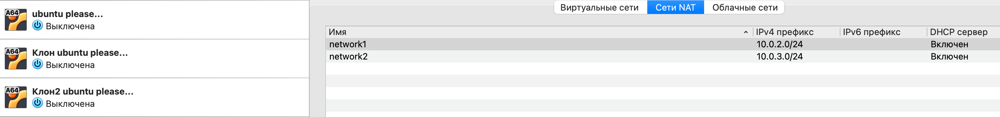
2. В настройках сети виртуальных машин выбираем пункт ```Сеть NAT``` и подключаем каждую машину к созданным нами ранее сетям. Виртаульная машина А должна быть подключена к двум разным сетям одновременно, чтобы иметь доступ ко Б и к В. Оставшиеся две подключаем только к одной сети.
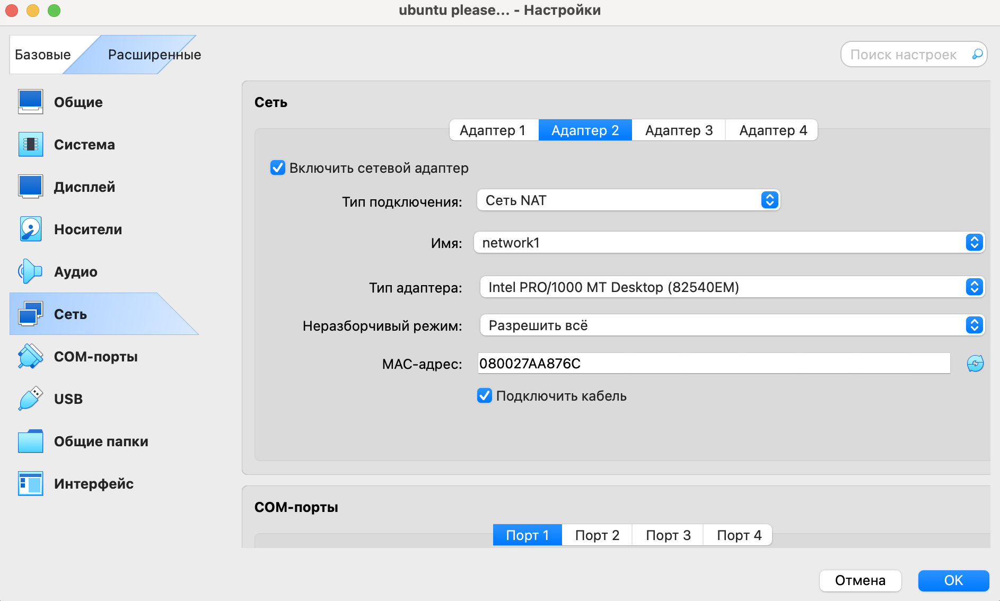
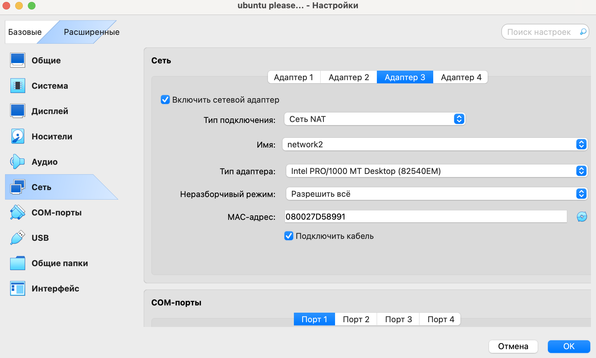
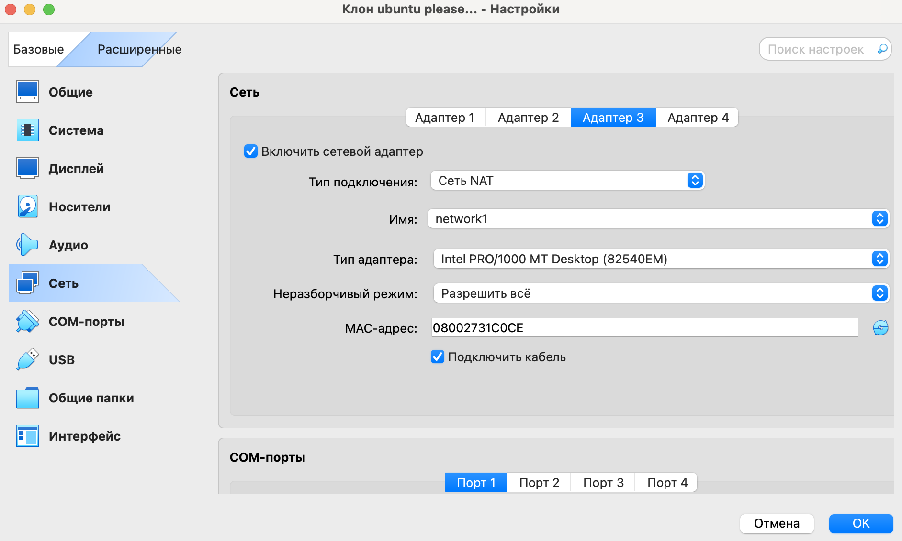
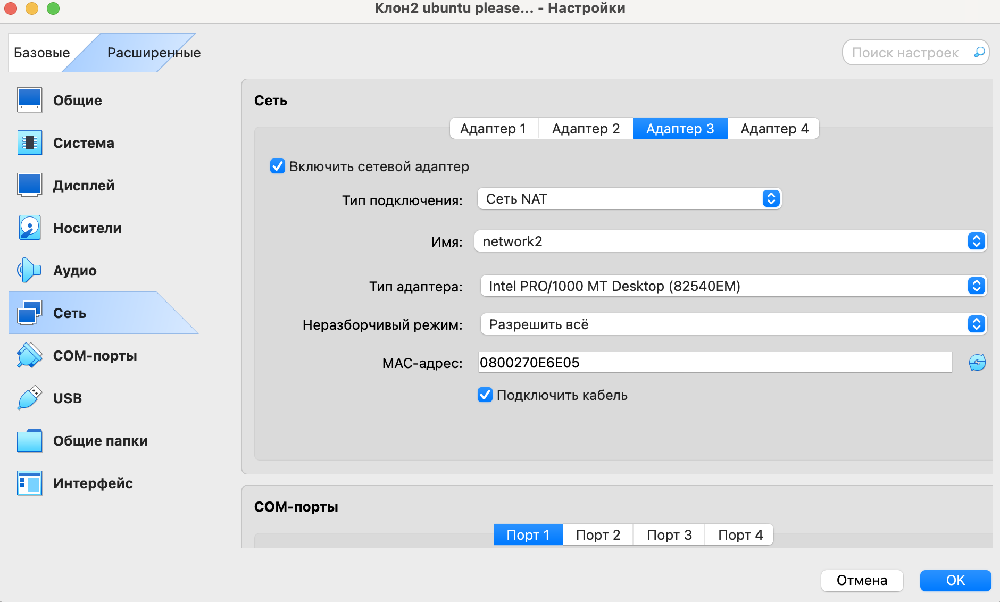
4. Запускаем виртуальные машины. Вводим команду ```ifconfig```, чтобы узнать ip-адреса.
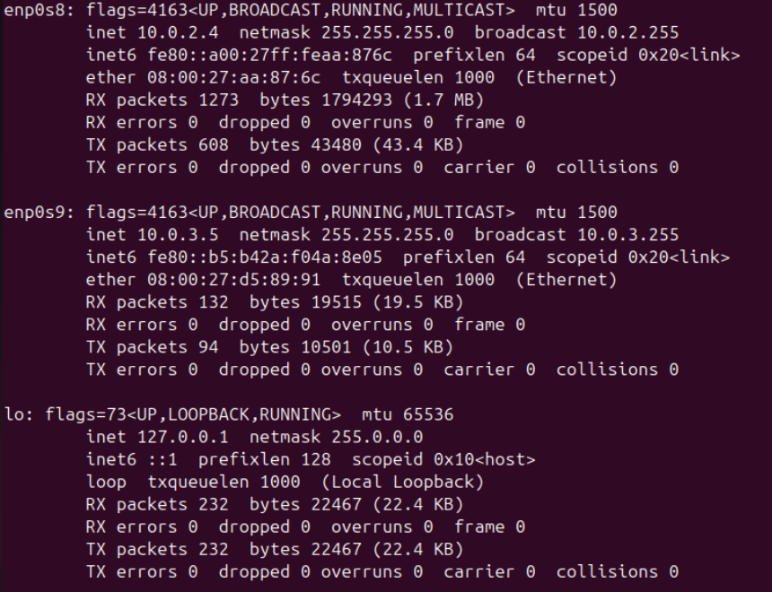
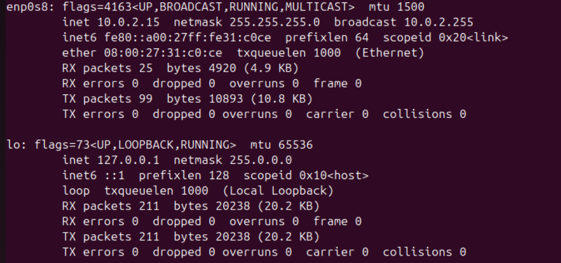
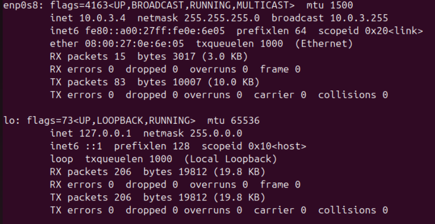
Как можно увидеть, машина А имеет два адреса - ```10.0.2.4``` и ```10.0.3.5```. Б имеет адрес ```10.0.2.15```, а В – ```10.0.3.4```.
6. Проверяем доступ в Интернет на всех машинах с помощью команды ```ping 8.8.8.8```.
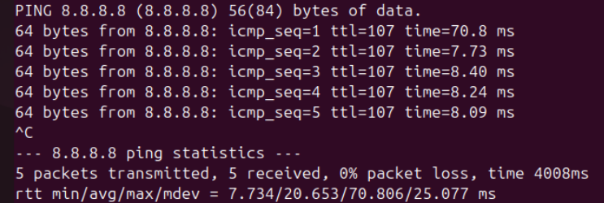
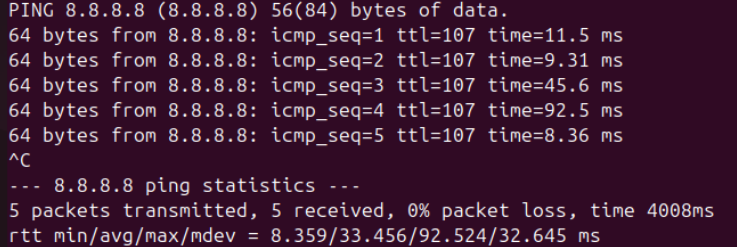
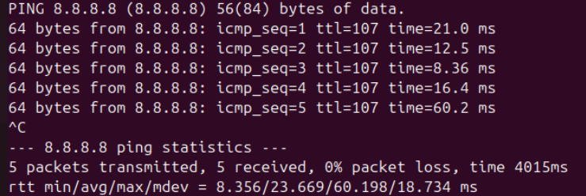
Все машины имеют доступ в Интернет.
7. Проверяем, существует ли связь между машинами с помощью команды ```ping <ip-address>```.

А:
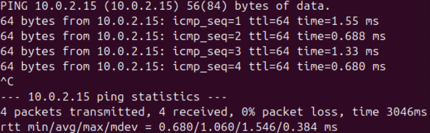
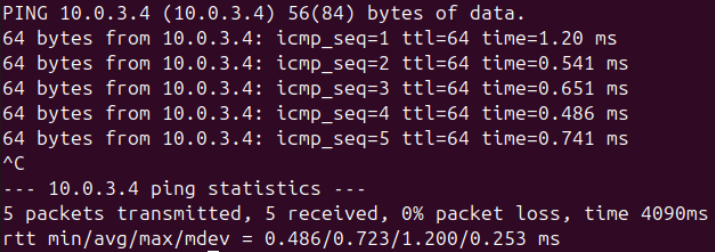

Б:
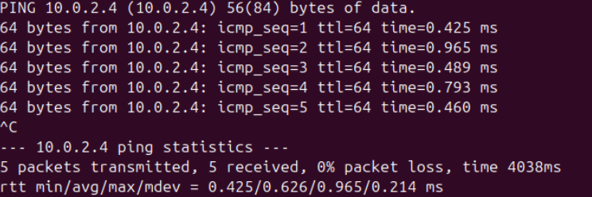
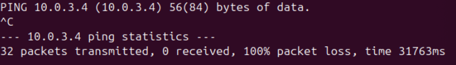

В:
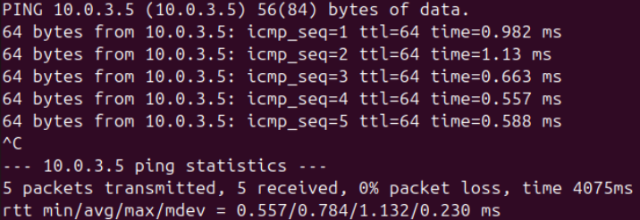
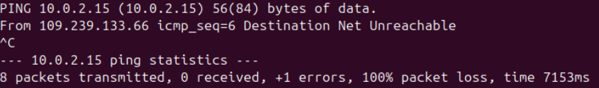

На скриншоте видно, что основная виртуальная машина имеет связь и с Б, и с В. При этом Б и В машины имеют связь с А. В то время как связи между Б и В нет – они находятся в разных подсетях. 
